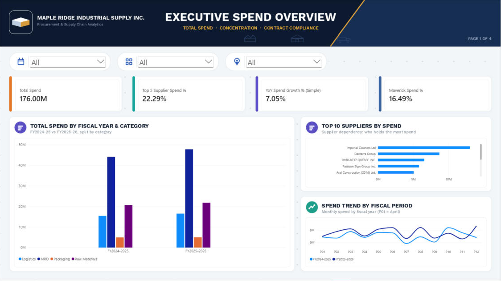
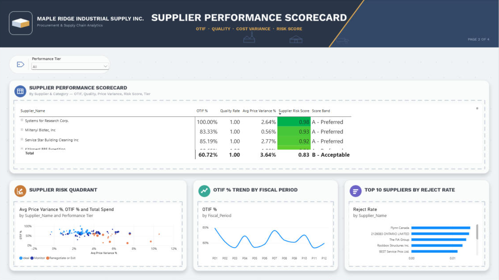
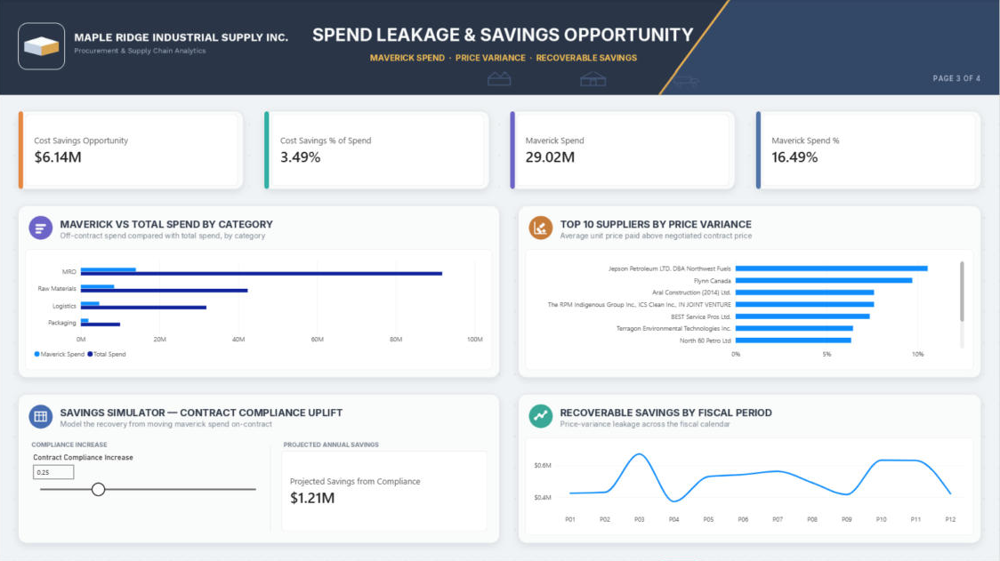
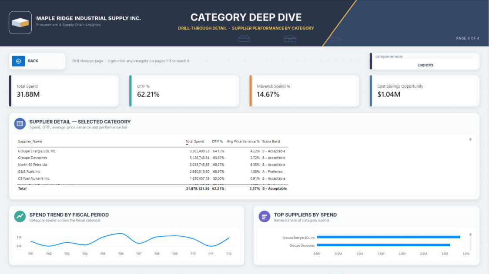

# Procurement Spend Analysis & Supplier Performance Scorecard

Excel + Power BI project looking at procurement spend, off-contract buying and supplier performance for a made-up Canadian manufacturer, Maple Ridge Industrial Supply Inc.

I built this during my Supply Chain Management program at Lambton College (Ottawa). I wanted a project that looks like the work a procurement analyst actually does, so instead of using a random Kaggle file I started from real Government of Canada contract data and built the analysis on top of it.

Scope: **$176.0M in spend, 2,513 POs, 96 suppliers, 4 categories, FY2024-25 and FY2025-26.**

The questions I was trying to answer:

1. Where is the money going (by supplier, category, period)?
2. How dependent are we on a small number of suppliers?
3. How much are we losing to off-contract (maverick) buying and paying above contract price?
4. Which suppliers should we keep, watch, or renegotiate with?



## About the data

This part matters, so I want to be upfront about it.

| Data | Real or simulated? |
|---|---|
| Supplier names, city/province, commodity descriptions, contract values (used to size spend per supplier) | **Real** - CanadaBuys Contract History from Public Services and Procurement Canada, [Open Government Portal](https://open.canada.ca/data/en/dataset/4fe645a1-ffcd-40c1-9385-2c771be956a4) |
| PO-level fields: order / promised / actual delivery dates, unit price vs. contract price, quantity, on/off-contract flag, quality rejects, payment terms | **Simulated** - the public data only has contract awards, not delivery, quality or pricing history, so I generated these fields on top of the real suppliers |

So the dollar numbers below show how the method works. They are not real results for any actual organisation.

## What I found

| KPI | Result | What it means |
|---|---|---|
| Total spend | $176.0M, up 7.1% YoY in FY25-26 | Spend is growing, so every savings lever is worth more next year |
| Maverick spend | $29.0M (16.5%) | About 1 in every 6 dollars skips the negotiated contract. Raw Materials (20.0%) and Packaging (19.1%) are the worst |
| Savings opportunity | $6.14M (3.5% of spend) | Money paid above the contract price. 79% of it is on off-contract POs |
| Projected savings at 50% compliance | $2.42M | If half the maverick buying moved onto contract. There's a What-If slider in Power BI to change the % |
| Concentration | Top 5 = 22.3%, Top 10 = 34.5%, 44 of 96 suppliers = 80% of spend | Low dependency risk, but a long tail of small suppliers |
| OTIF | 60.7% | Biggest operational problem. Quality is 99.8% by units, but 14% of POs have at least one reject and one reject fails OTIF |
| Supplier segments | 40 Ideal / 39 Monitor / 17 Renegotiate or Exit | "Renegotiate or Exit" = below-average OTIF and above-average price variance |

The OTIF result surprised me at first. Quality looked almost perfect, but once I split OTIF failures into "late" vs "had a reject", it was clear a lot of orders were failing on a single rejected unit. That's why I added the OTIF root-cause sheet in Excel.

## Recommendations

1. Start contract compliance with Raw Materials and Packaging (catalogues, blanket POs) since that's where most of the leakage is.
2. Put the 17 "Renegotiate or Exit" suppliers on a 90-day improvement plan with OTIF and price targets. Dual-source the risky ones.
3. Consolidate the Class C tail suppliers in each category to get better volume pricing.
4. Audit invoices against contract price for the suppliers with the highest price variance.
5. Review the scorecard every quarter.

## How I built it

**1. Data prep (Excel + Power Query)**
- Downloaded the CanadaBuys contract history files, mapped the vendors into 4 categories (Raw Materials, Packaging, MRO, Logistics) and built the PO-level fields on top.
- Cleaned the keys (trimmed/typed `Supplier_ID`), converted text dates to real dates, removed note rows.

**2. Data model (star schema)**
```
     Dim_Supplier (96)      Dim_Category (4)
             \                  /
              1:*            1:*
                \            /
            PO_Transactions (2,513)
                     |
                    *:1
                     |
       Dim_Date (fiscal calendar, Apr-Mar)
```
- `Dim_Date` is a DAX calendar with Fiscal_Year and Fiscal_Period (P01 = April, since the government fiscal year starts in April).
- Power Query reads the Excel file through a `DataFolder` parameter so the report can be refreshed on another computer.

**3. Excel analysis** (`/excel`)
- Executive dashboard with formula-driven KPIs, a What-If input and reconciliation checks.
- Sheets for Pareto/ABC, Supplier Scorecard, OTIF root cause, Price Variance and Maverick Spend.
- Lookups use `INDEX/MATCH` on `Supplier_ID` instead of supplier name (names aren't unique/consistent).

**4. Power BI dashboard** (`/powerbi`) - 4 pages

| Page | What's on it |
|---|---|
| Executive Overview | KPI cards, spend by FY and category, top 10 suppliers, spend trend by fiscal period |
| Supplier Scorecard | Supplier matrix with conditional formatting, risk quadrant scatter, OTIF trend, reject rate |
| Spend Leakage & Savings | Maverick vs total by category, price variance by supplier, What-If "Contract Compliance %" |
| Category Deep Dive | Drill-through page (right-click a category > Drill through) |

| Supplier Scorecard | Spend Leakage & Savings |
|---|---|
|  |  |

| Category Deep Dive (Logistics) |
|---|
|  |

## Main DAX measures

```dax
OTIF % =
DIVIDE(
    CALCULATE(COUNTROWS(PO_Transactions),
        PO_Transactions[Actual_Delivery_Date] <= PO_Transactions[Promised_Delivery_Date],
        PO_Transactions[Quality_Reject_Qty] = 0),
    COUNTROWS(PO_Transactions))

Cost Variance Score =
VAR v = [Avg Price Variance %]
RETURN IF(v <= 0, 1, MAX(0, 1 - v * 2))   -- 0% over contract = 1, 25% over = 0.5, 50%+ = 0

Supplier Risk Score (Base) = [OTIF %] * 0.4 + [Quality Rate] * 0.3 + [Cost Variance Score] * 0.3

Supplier Risk Score =   -- total = average of supplier scores, not a score of the total
AVERAGEX(FILTER(VALUES(Dim_Supplier[Supplier_ID]), [Total POs] > 0), [Supplier Risk Score (Base)])

Projected Savings from Compliance =
CALCULATE([Cost Savings Opportunity], PO_Transactions[On_Contract_Flag] = "No")
    * 'Contract Compliance Increase'[Contract Compliance Increase Value]
```

## Why I made some of the choices I did

- **Weighted score instead of one metric** - a supplier can be the cheapest and still be the least reliable. Weighting OTIF 40 / Quality 30 / Cost 30 shows that trade-off.
- **Projected savings only counts off-contract overpayment** - getting people to buy on contract fixes maverick leakage. Overpaying on POs that are already on contract is an invoice-audit problem, which is a different fix.
- **Ideal / Monitor / Renegotiate is relative** - it compares each supplier to this portfolio's averages, not an industry benchmark, so it would shift with different data.
- **Excel and Power BI match** - I checked every headline KPI in both tools and they reconcile.

## Things that tripped me up

- My first YoY measure used `SAMEPERIODLASTYEAR`, which gave odd numbers with the April-March fiscal year. I switched to a simpler fiscal-year comparison and marked `Dim_Date` as the date table.
- The supplier risk score at the total level was wrong at first because it was calculating the score of the whole portfolio, not averaging the suppliers. `AVERAGEX` over suppliers fixed it.
- My Excel and Power BI savings numbers didn't match for a while because I'd defined projected savings differently in each. Lining those up forced me to decide what the number really means.

## Repo structure
```
/data          CanadaBuys CSVs + the cleaned dataset
/excel         Procurement_Spend_Analysis_MapleRidge_FINAL.xlsx
/powerbi       Procurement_Spend_Analysis_MapleRidge_Dashboard.pbix
/screenshots   one image per dashboard page
/assets        page backgrounds and design mockups
```

**Opening the .pbix:** Home > Transform data > Edit parameters > set `DataFolder` to the folder with the Excel file > Refresh.

## Tools
Excel (Power Query, INDEX/MATCH, SUMIFS/COUNTIFS, SUMPRODUCT, conditional formatting, charts), Power BI Desktop (Power Query M, DAX, star schema, What-If parameters, drill-through)

## Author
Dhavalkumar Pandav - Supply Chain Management, Lambton College, Ottawa
